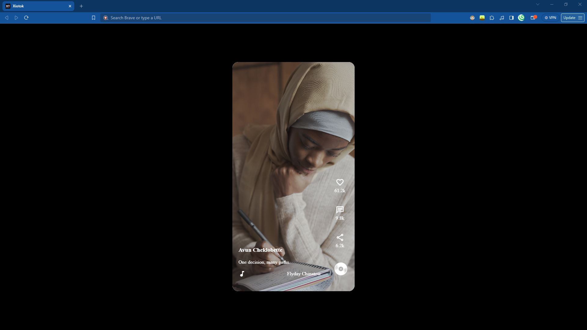
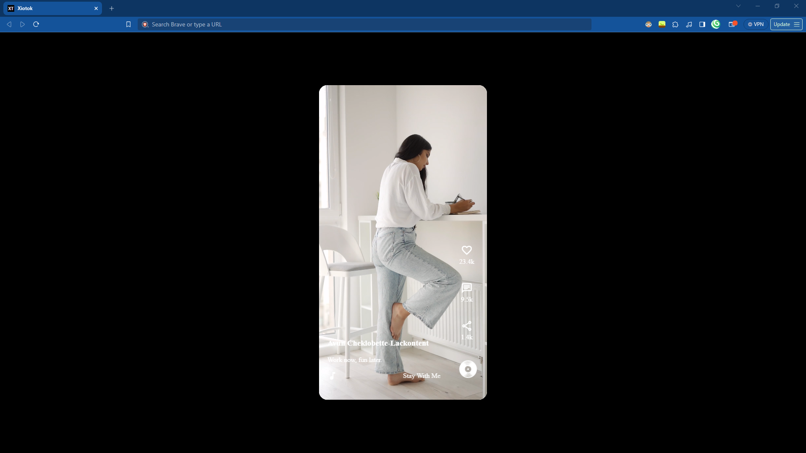

# XioTok :: TikTok Clone

This Github Repository is form XioTok - a clone of Tiktok. This is basically just for me and I put it here basically for backup. You can change to have your own videos and how many you may want in there - but for now we are using [Pexels StockImages](https://pexels.com)

**(thanks FutureCoders!)**


## Acknowledgements

 - Original Code Written and shown on [FutureCoders](https://www.youtube.com/watch?v=HBEUXujJh1A&t=11s)' channel.

 - Shout out to: [Xiotim-Studium Tools](https://xio-tim.github.io/studium)

 - Something that has helped a lot in this random projects is: [DiffChecker](https://diffchecker.com)

## Authors

 - [Xiotim Corp.](https://github.com/xio-tim)

 - [Avun](https://github.com/avun-ai)

 - [FutureCoders](https://www.youtube.com/@FutureCoders)


## Demo

This doesn't contain a demo, but you can find it on the adress listed [here](https://xio-tim.github.io/xiotok). Please do boost and fork this Github Repo (or don't, I really don't care.)


## Features

- Add as many videos as You want.

- Customize the Videos that you would like to see on the XioTok.

- Customize the Like, Share, and Comment attributes to how you want. 

- **PS:** If you want the best looks please use shortened numbers  like 1M instead of 1,000,000.


## Screenshots





All Done in HTML, CSS and under 10 lines of JavaScript.

## Run Locally

Clone the project and Run it on XAMPP (**PS:** I would recommend having a locally hosted domain for this step, it makes this process more satisfying.)

```bash
  git clone https://github.com/xio-tim/xiotok
```

Go to the project directory

```bash
  cd xiotok
```

Install XAMPP (via Choclately.)

```bash
  choclately install xampp
```

Start the server with a command

```bash
    [Directory]/[ServerName]/apache-start.bat
```


## Roadmap

- Not really much, just implemented like, share and comment counters.

- Add as many videos as you want for the XioTok.

- A XT in the style of TikTok as the FavIcon.

- Written By Hand

- Written in the Front-end Languages. HTML, CSS & Javascript.

- Browser support for the Big Three (Chrome, Firefox, (Edge & Safari) - Gecko)


## Support

For support, [email us](mailto:trowesigames@gmail.com) or join our Discord Group (it may not be up right now).

## Feedback

This also is the same for Feedback - whether it is positive, or negative - you can give us constructive-critisim. No hate please, otherwise we encourage you to [email us](mailto:trowesigames@gmail.com).


## FAQ

#### Can I change up whatever I would like?

Yes, most definetly. This is just a placeholder for your creativity, so please have fun with it, You can do wonders, with it. We would like to see you over on Mastodon.

#### Can I host this?!

I have said previously, that you can, but if you are a beginner I reccomend a [tutorial](https://www.youtube.com/watch?v=LzucEZh4_no) for XAMPP. I have not experienced WAMP, but ~6 years into using XAMPP and it works very nicely.


## Used By

This project is used by the following companies:

- Studium

- noHesi

- Xiotim


## Installation

Please I insist install XAMPP.. If you want anymore instructions look at the FAQ or please refer to Run Locally... please, please, please.

```bash
  choclatey install xampp
```
    
## Tech Stack

**Client:** HTML & CSS

**Server:** JavaScript (partially).


## Documentation

- I cannot tell about all of the documentation, so please refer to:

- [FutureCoder](https://www.youtube.com/watch?v=HBEUXujJh1A&t=11s)'s tutorial.


## API Reference

This doesn't user any APIs or any Frameworks - so it doesn't need any APIs, very surface-level project, if it needs any more I will make sure to be telling you in the future read-mes.

